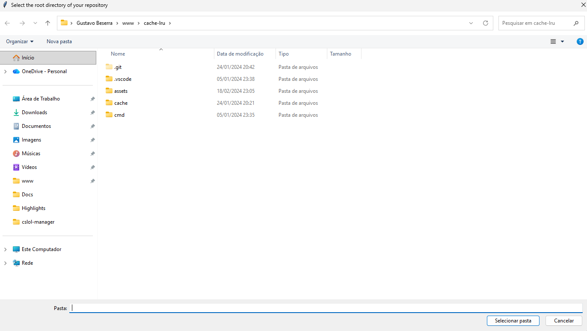

# repo-indexer

indexes a local codebase into a SQLite database so you can query it instead of grepping through thousands of files.

## why

i wanted a way to understand large codebases (think 100GB, millions of files) without opening every file. Since files carry information and directory structure basically *is* the architecture, so i built a tool that walks a repo, extracts metadata, and dumps it into SQLite where i can run whatever queries i want.

## what it does

- recursively walks a directory tree (skipping `.git`, `node_modules`, etc.)
- extracts metadata per file: path, filename, extension, language, size, line count, depth, last modified
- full-text search via FTS5 — paths are tokenized (split on `/`, `.`, `_`, `-`) and stored in an inverted index, so keyword lookups use `MATCH` instead of `LIKE '%keyword%'`
- stores everything in a SQLite database
- pops up a folder picker so you don't have to type paths

## usage

```
python main.py
```

A file dialog opens, pick the repo root. it walks the tree, extracts metadata, and writes to `base_name_ + data.db`.

<details>
  <summary>Dialog window</summary>

  
</details>

then open the database with any SQLite client and go wild.

### basics

```sql
-- what languages make up this codebase?
SELECT language, COUNT(*) as files, SUM(line_count) as total_lines
FROM files
GROUP BY language
ORDER BY total_lines DESC;

-- biggest files by line count
SELECT filename, line_count, size
FROM files
ORDER BY line_count DESC
LIMIT 10;

-- biggest files by bytes on disk
SELECT path, size, line_count
FROM files
ORDER BY size DESC
LIMIT 10;

-- what's the deepest nested file?
SELECT path, depth
FROM files
ORDER BY depth DESC
LIMIT 5;
```

### FTS5 path search

`file_fts.tokenized_path` is an inverted index over path segments, so these are cheap:

```sql
-- find files related to payments
SELECT f.path, f.line_count
FROM file_fts fts
JOIN files f ON f.id = fts.rowid
WHERE fts.tokenized_path MATCH 'payment';

-- AND across keywords (default behavior)
SELECT f.path, f.line_count
FROM file_fts fts
JOIN files f ON f.id = fts.rowid
WHERE fts.tokenized_path MATCH 'cache test';

-- OR across keywords
SELECT f.path
FROM file_fts fts
JOIN files f ON f.id = fts.rowid
WHERE fts.tokenized_path MATCH 'auth OR session OR token';

-- prefix match (anything starting with "checkout")
SELECT f.path
FROM file_fts fts
JOIN files f ON f.id = fts.rowid
WHERE fts.tokenized_path MATCH 'checkout*';

-- keyword but exclude tests/mocks/fixtures
SELECT f.path
FROM file_fts fts
JOIN files f ON f.id = fts.rowid
WHERE fts.tokenized_path MATCH 'payment NOT test NOT mock NOT fixture';
```

### investigation queries

Useful when you're dropped into an unfamiliar repo and need to orient fast.

```sql
-- directory footprint: which folders carry the most code?
SELECT
  substr(path, 1, length(path) - length(filename) - 1) AS directory,
  COUNT(*) AS files,
  SUM(line_count) AS lines,
  SUM(size) AS bytes
FROM files
GROUP BY directory
ORDER BY lines DESC
LIMIT 20;

-- recently modified files — where is active development happening?
SELECT path, modified, line_count
FROM files
ORDER BY modified DESC
LIMIT 25;

-- stale files — candidates for dead code
SELECT path, modified, line_count
FROM files
WHERE language NOT IN ('text', 'unknown')
ORDER BY modified ASC
LIMIT 25;

-- empty or near-empty source files (often stubs or placeholders)
SELECT path, line_count, size
FROM files
WHERE line_count <= 1 AND language NOT IN ('text', 'unknown')
ORDER BY path;

-- duplicated filenames across the tree — possible copies, forks, or re-implementations
SELECT filename, COUNT(*) AS copies, GROUP_CONCAT(path, ' | ') AS locations
FROM files
GROUP BY filename
HAVING copies > 1
ORDER BY copies DESC
LIMIT 20;

-- file-size distribution per language (spot outliers worth reading first)
SELECT language,
       COUNT(*) AS files,
       AVG(line_count) AS avg_lines,
       MAX(line_count) AS max_lines
FROM files
WHERE language NOT IN ('text', 'unknown')
GROUP BY language
ORDER BY max_lines DESC;

-- entry points live shallow; concentrate on depth <= 3
SELECT path, language, line_count
FROM files
WHERE depth <= 3 AND language NOT IN ('text', 'unknown')
ORDER BY line_count DESC
LIMIT 20;

-- find tests, then measure how much test code exists
SELECT language, COUNT(*) AS test_files, SUM(line_count) AS test_lines
FROM file_fts fts
JOIN files f ON f.id = fts.rowid
WHERE fts.tokenized_path MATCH 'test OR tests OR spec'
GROUP BY language
ORDER BY test_lines DESC;

-- config surface area (CI, build, infra)
SELECT f.path, f.extension, f.line_count
FROM file_fts fts
JOIN files f ON f.id = fts.rowid
WHERE fts.tokenized_path MATCH 'config OR dockerfile OR terraform OR github OR ci'
ORDER BY f.line_count DESC
LIMIT 25;

-- migrations / schema evolution
SELECT f.path, f.modified
FROM file_fts fts
JOIN files f ON f.id = fts.rowid
WHERE fts.tokenized_path MATCH 'migration OR migrations OR schema'
ORDER BY f.modified DESC;

-- scope an FTS hit to a specific top-level area
SELECT f.path, f.line_count
FROM file_fts fts
JOIN files f ON f.id = fts.rowid
WHERE fts.tokenized_path MATCH 'payment'
  AND f.path LIKE '%/src/%';
```

### AI Use
Tokens cost money, so if you have a huge codebase and want to know what something does, you can do the following:

```sql
-- search a specific keyword you think will bring something interesting
SELECT f.*
FROM file_fts fts
JOIN files f ON f.id = fts.rowid
WHERE fts.tokenized_path MATCH 'buddy';
```

<details>
  <summary> Output </summary>
  
  

</details>

This way you can copy and paster specific paths and better scope the AI use.

## requirements

python 3.8+ (uses `os.scandir`, `pathlib`, `tkinter` — all standard library, no pip installs needed)

## what's next

- [ ] query CLI so you don't need a separate SQLite client
